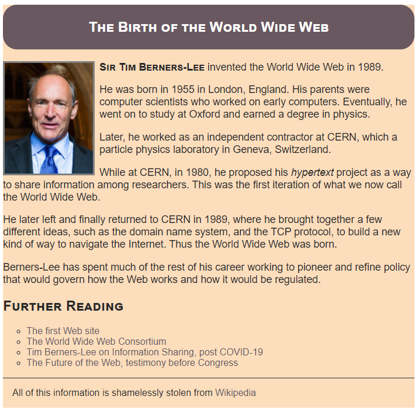

# Welcome to the Mid-term Exam!

This exam will primarily explore your understanding of the relationship between HTML and CSS and your ability to apply CSS styling to an existing HTML web page.

## Instructions

Your task is to take the existing HTML page and apply a set of styles to it. You will be re-creating the following page:

Here are the specific style changes you must make.

* The width of the content should be constrained to 750 pixels.
* The entire background must be the color #FCDDBC
* The primary text color must be #292929;
* The top heading will have a background color of #69585F with a text color of white. It must also have a border-radius (try to get it to look like the mockup) as well as top and bottom padding (look up the difference between padding and margins)
* Links must have underlines removed and their color changed to #69585F
* The image must have the text wrap up its right side (look up the `float` property).
* The image must also have a solid gray border and appropriate spacing around it.
* Everything must have appropriate space around it so that it is easy to read and looks nice.
* The subject name and the h1-h2 elements must have the small-caps variant.
* The bullet points should be circles instead of dots

You are free to add classes to HTML elements, but otherwise, do attempt to leave the HTML code as it is. In fact, in some cases, you will _have_ to add classes. Each time you are going to style an element, think to yourself whether this style should be applied to _all_ elements of that type. If the answer is no, use a class! Points will be deducted for not using classes appropriately.

Other than adding classes to the HTML, _all_ of your code should go in the `style.css` file.

If you have any questions or something isn't doing exactly what you think it should do, please don't hesitate to ask!
